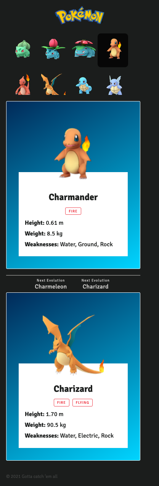
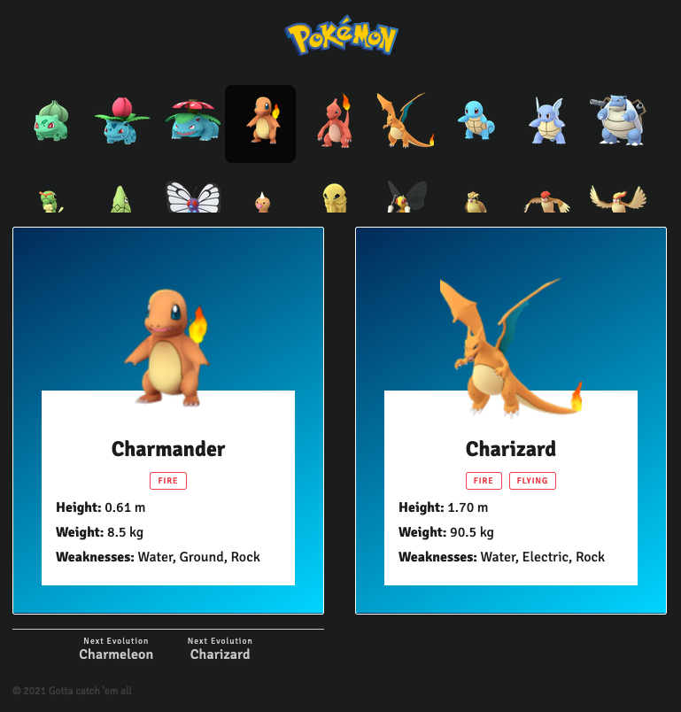
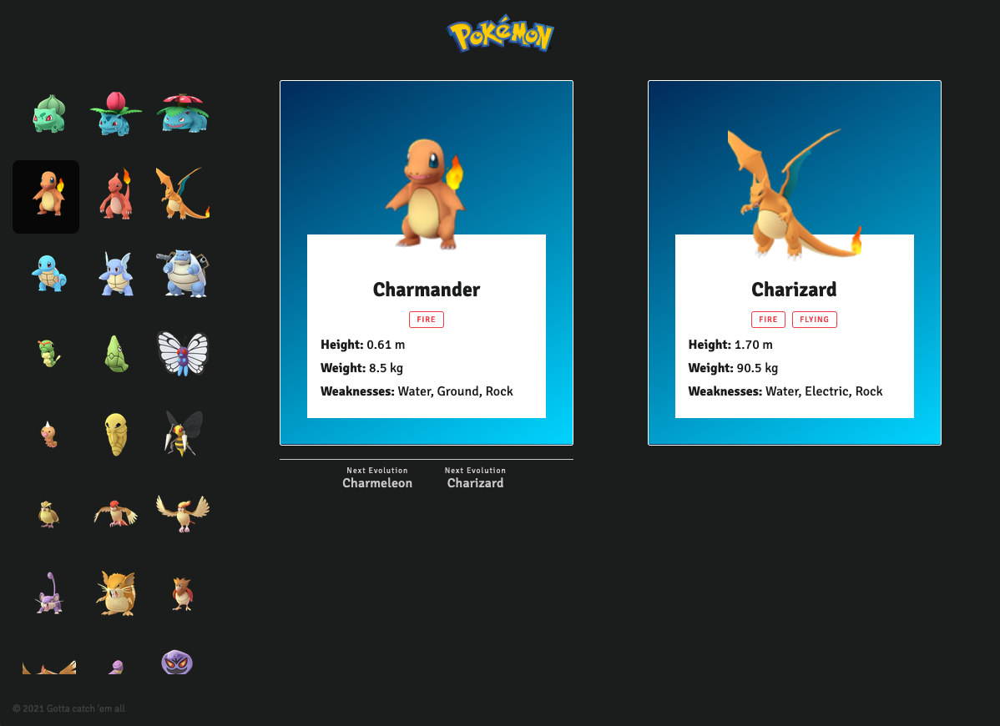

# Estudio Cactus Fullstack Test

This is a test to validate the knowledge of the candidates for the position of fullstack developer at Estudio Cactus

## Stack

- React
- NextJS
- Firebase
- Tailwindcss

## Description

The project must be developed as a SPA in Javascript in which the following must be developed:

- Header with the pokemon logo
- A list
- A card with the selected pokemon
- A card with the pokemon's evolution(if it has one)
- Footer with copyright

All the Pokemons data is stored in Firebase(firestore) in the collection 'pokemons':

```
.
└── firestore(/)
    └── pokemons
```

The credentials file for firebase is located at

```
.
└── firebase
    └── config
```

The page should be created in the following file, the initial styles and typography(/styles/global.css) are already set:

```
.
└── pages
    └── index.js
```

These are the designs we are expecting to find.

| Moblie                            | Tablet                            | Desktop                             |
| --------------------------------- | --------------------------------- | ----------------------------------- |
|  |  |  |

The necessary images for the UI are located in:

```
.
└── ui
    ├── svg
```

The functionality should be the following


## How to start?

1. Create a new repo utilizing this one as a base(without forking)
2. Make at least 1 first commit with the original code, to see the init hour.
3. Make individiual commits for each block you create. The last commit marks the end.
4. Send us a link to your repo.

## What we value?

- Simplicity of the solution
- Organization and clean code
- Utilization of components
- Mobile first & RWD
- Git usage
- Web Performance Optimization
- Technical knowledge
- Layout knowledge (HTML5 y CSS3)
